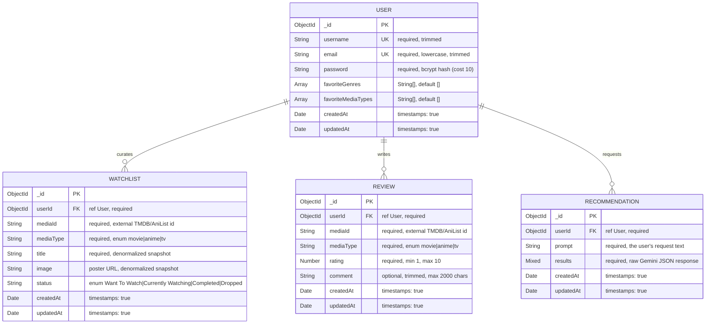

# Fabulis

AI-powered entertainment discovery for movies, TV shows, and anime all in one place, search across three catalogues, track what you're watching, and get recommendations from an AI that actually understands the difference between an anime film and a live-action series.

---

## Demo

**Live Link:** [https://fabulis.onrender.com/](https://fabulis.onrender.com)


**Demo account**

```
Email: test@test.com
Password: testpass
```

---

## Features

**Accounts & preferences**: Register/login with JWT auth. Save favorite genres and media types, which feed directly into AI recommendation quality.

**Unified discovery**: Browse and search movies, TV, and anime from one interface, backed by three different upstream APIs normalized into a single card format. Infinite scroll with a page cap.

**Watchlist**: Add any title and track it through four states: *Want To Watch → Currently Watching → Completed → Dropped*. Status changes save instantly with no page reload.

**Ratings & reviews**: Rate any title 1-10 with an optional comment. Ratings update, so re-rating updates your existing entry rather than stacking duplicates.

**AI Discovery**: Describe a mood, a favorite title, or exactly what you're after, and get five tailored recommendations.

- **Two-axis classification.** Each result carries an independent `format` (`movie` / `series`) *and* `origin` (`anime` / `live-action`). A film like *Your Name* is correctly labelled **Anime Movie** rather than being flattened into just "anime" or "movie.
- **Negative signal.** Titles you've marked *Dropped* are passed to the model as an exclusion list, so it stops recommending things you've already rejected.

Recommendations also suggest where to stream each title, and every conversation is persisted to a browsable history.

**Title detail pages**: Full synopsis, genres, runtime/episode counts, and cast of real actors for movies and TV, Japanese voice actors (with the characters they play) for anime.

---

## Tech stack

| Layer | Technology |
|---|---|
| **Runtime** | Node.js (ES Modules) |
| **Server** | Express 4 |
| **Database** | MongoDB Atlas + Mongoose 8 |
| **Auth** | JSON Web Tokens (`jsonwebtoken`), password hashing via `bcryptjs` |
| **Security** | `helmet`, `express-rate-limit`, `cors` |
| **HTTP client** | `axios` |
| **Frontend** | Vanilla HTML, CSS, and JavaScript |
| **Movies & TV** | [TMDB API](https://developer.themoviedb.org/) (REST) |
| **Anime** | [AniList API](https://anilist.gitbook.io/anilist-apiv2-docs/) (GraphQL) |
| **AI** | Google Gemini (`gemini-flash-latest`) |

---

## Running the server

**Prerequisites:** Node.js 18+, a MongoDB database (Atlas or local), a [TMDB API key](https://www.themoviedb.org/settings/api), and a [Google Gemini API key](https://aistudio.google.com/apikey).

**1. Install dependencies**

```bash
cd server
npm install
```

**2. Create `server/.env`**

```env
MONGODB_URI=your_mongodb_connection_string
JWT_SECRET=any_long_random_string
TMDB_API_KEY=your_tmdb_key
GEMINI_API_KEY=your_gemini_key
```

`PORT` is optional and defaults to `5000`. `.env` is gitignored and must never be committed.

**3. Start the server**

```bash
npm run dev     # nodemon, restarts on change
# or
npm start       # plain node
```

You should see `MongoDB connected` and `Server running on port 5000`.

**4. Open the app**

Visit <http://localhost:5000>.

Express serves both the API and the frontend from the same origin, so there's no second server to start and no CORS setup. A health check is available at `/api/health`.


## Architecture

**The backend is a proxy, not just a database layer.** All three external services (TMDB, AniList, Gemini) are called server-side, so **no API key ever reaches the browser**.
It also lets each response be reshaped before it hits the client, which matters, because the three sources disagree about almost everything. TMDB returns `title` for movies but `name` for TV; AniList is GraphQL and returns scores on a 0–100 scale with HTML embedded in descriptions. Each service module normalises its responses into one consistent shape (`{ id, title, poster, rating, ... }`), so the frontend renders every result through a single shared card component regardless of source.

---

## Database schema



### Design notes

**There is deliberately no `Media` collection.** `mediaId` + `mediaType` are external references into TMDB/AniList rather than foreign keys into a local table. Only denormalised snapshots (`title`, `image`) are stored, so a watchlist renders without a third-party round-trip per item. This is why `Watchlist` and `Review` have no direct relationship to each other despite pointing at the same titles.

**Compound unique indexes.** Both `Watchlist` and `Review` carry a unique index on `{ userId, mediaId, mediaType }`. This enforces one watchlist entry and one review per user per title at the database level, and is why `POST /api/reviews` upserts rather than creating duplicates.

**`Recommendation.results` is `Mixed`** - the raw JSON returned by Gemini. Keeping it schema-less means the AI response format can evolve without a migration, at the cost of no schema validation on that field.

---

## API reference

Base URL: `/api`

### Authentication

| Method | Endpoint | Auth | Description |
|---|---|---|---|
| `POST` | `/auth/register` | Public | Create an account, returns a JWT |
| `POST` | `/auth/login` | Public | Log in, returns a JWT — **rate limited to 10 attempts per 15 min per IP** |
| `GET` | `/auth/profile` | Protected | Current user (password excluded) |
| `PUT` | `/auth/profile` | Protected | Update favourite genres / media types |

### Media

| Method | Endpoint | Auth | Description |
|---|---|---|---|
| `GET` | `/movies/popular` | Public | Popular movies (TMDB) |
| `GET` | `/tv/popular` | Public | Popular TV shows (TMDB) |
| `GET` | `/anime/popular` | Public | Popular anime (AniList) |
| `GET` | `/search?query=&type=&page=` | Protected | Search movies or anime |
| `GET` | `/movies/:id` | Protected | Movie detail incl. cast |
| `GET` | `/tv/:id` | Protected | TV detail incl. cast |
| `GET` | `/anime/:id` | Protected | Anime detail incl. voice cast |

### Watchlist

| Method | Endpoint | Auth | Description |
|---|---|---|---|
| `POST` | `/watchlist` | Protected | Add a title (`409` if already present) |
| `GET` | `/watchlist` | Protected | The user's full watchlist, newest first |
| `PUT` | `/watchlist/:id` | Protected | Update status |
| `DELETE` | `/watchlist/:id` | Protected | Remove an entry |

### Reviews

| Method | Endpoint | Auth | Description |
|---|---|---|---|
| `POST` | `/reviews` | Protected | Create or update a rating (`201` new / `200` updated) |
| `GET` | `/reviews/:mediaId` | Public | All reviews for a title, with usernames |
| `DELETE` | `/reviews/:id` | Protected | Delete your own review |

### AI

| Method | Endpoint | Auth | Description |
|---|---|---|---|
| `POST` | `/recommend` | Protected | Generate 5 recommendations from a prompt |
| `GET` | `/recommend/history` | Protected | Past AI conversations, newest first |

---

## Project structure

```
fabulis/
├── client/                     # Static frontend
│   ├── index.html              # Landing page
│   ├── css/style.css           # All styling
│   ├── js/
│   │   ├── api.js              # fetch wrapper, attaches JWT
│   │   ├── auth-guard.js       # Redirects unauthenticated visitors
│   │   ├── media-card.js       # Shared card renderer + delegated handlers
│   │   ├── dashboard.js        # Watchlist preview + popular row
│   │   ├── explore.js          # Browse/search with infinite scroll
│   │   ├── detail.js           # Title detail page
│   │   ├── ai-discovery.js     # AI chat + history
│   │   └── profile.js          # Preferences + full watchlist + stats
│   └── pages/                  # dashboard, explore, detail, profile, ai-discovery, login, register
│
└── server/
    ├── server.js               # Entry point, middleware, route mounting
    ├── models/                 # Mongoose schemas
    │   ├── User.js             # + bcrypt pre-save hook
    │   ├── Watchlist.js
    │   ├── Review.js
    │   └── Recommendation.js
    ├── controllers/            # Request handlers
    ├── routes/                 # Route definitions + auth middleware wiring
    ├── middleware/
    │   └── authMiddleware.js   # JWT verification
    └── services/               # External API integrations
        ├── tmdbService.js      # Movies + TV
        ├── anilistService.js   # Anime (GraphQL)
        └── geminiService.js    # AI prompt construction + parsing
```

---

## Security

Implemented:

- **Passwords** hashed with bcrypt (cost 10) via a Mongoose pre-save hook; never returned by any endpoint.
- **JWT** authentication with a 7-day expiry, verified by middleware on every protected route.
- **Login rate limiting** - 10 attempts per 15 minutes per IP.
- **Security headers** via `helmet`.
- **Ownership scoping** every update/delete query is filtered by `userId` alongside the record ID, so no user can read or modify another user's data by guessing IDs.
- **NoSQL injection guards** request fields used in queries are type-checked before reaching Mongoose, rejecting operator-object payloads such as `{"email": {"$gt": ""}}`.
- **API keys** live only in `.env` on the server and are never sent to the browser.

Current gaps:

- The JWT is stored in `localStorage`, not an `httpOnly` cookie, meaning any XSS would expose the token. Migrating to a cookie is the main hardening step remaining.
- CORS is open unless `CLIENT_ORIGIN` is set to moot for the bundled single-origin deployment, but relevant if the frontend is ever hosted separately.
- No automated test suite.

---

## Limitations & roadmap

- **Gemini free tier allows 20 requests/day.** Once exhausted, AI Discovery returns a clear "hit its request limit" message rather than a generic failure, but it won't generate results until the quota resets.

Planned: httpOnly cookie auth, Jest coverage on the watchlist and review controllers, real streaming-provider data via TMDB's watch-providers endpoint, and public review display on title pages.

---

## License

Built as an academic project.
